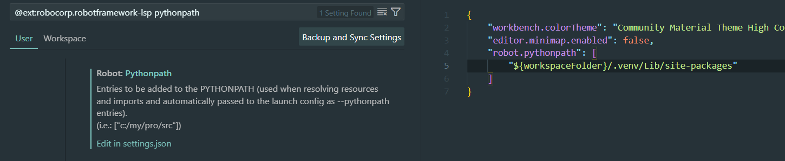

<p align="center">
  
</p>

<h1 align="center"> IT-TESTQUA31 Final Project </h1>

<!-- Tech Stack Badges -->
<p align="center">
  
  
</p>

<p align="center"><i>📅 Updated as of October 30, 2024</i></p>

---

## 📚 Project Overview

Robotic Process Automation (RPA) of the <a href="https://github.com/kkreiju/StudentPortal">IT-ELDNET1 StudentPortal</a>
 using Robot Framework and Python.

---

## 👥 Members

- 👨‍💻 **Arjay Nino Saguisa** – Sole Tester / Automation Developer
- 🎨 **John Reddick Quijano** – Provided UI Draft from <a href="https://github.com/kkreiju/StudentPortal">IT-ELDNET1 StudentPortal</a> Project

---

## 📦 Instructions

### 🔧 Use PyCharm or Visual Studio Code

### ⚙️ Set Up Virtual Environment
```powershell
python -m venv .venv
.\.venv\Scripts\activate
```
🛡️ *If activate.ps1 will not execute run this command as administrator*
```powershell
Set-ExecutionPolicy -ExecutionPolicy RemoteSigned -Scope CurrentUser
```

### 📥 Install Robot Framework Dependencies
```powershell
pip install robotframework robotframework-browser robotframework-requests robotframework-seleniumlibrary robotframework-selenium2library
```

### 💡 Install Pip Dependency Tree (optional)
```powershell
pip install pipdeptree
```
### 📥 Install RCC
```powershell
curl -o rcc.exe https://downloads.robocorp.com/rcc/releases/latest/windows64/rcc.exe
```
### ▶️ Run Robot Framework File
```powershell
cd TestquaAutomation
..\rcc.exe run -t "TESTQUA"
```

<hr>

### 💡 **For Visual Studio Code**

*Configure Python Language Server in Robot Framework Language Server Extension to ensure site packages are loaded*

<p align="center">
  
</p>
